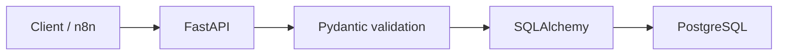
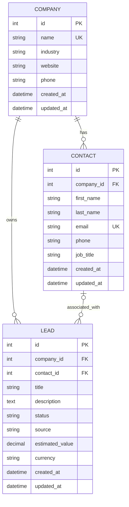

# LeadFlow CRM API

A production-oriented CRM backend built with FastAPI, PostgreSQL, SQLAlchemy, Alembic, Docker, and Pytest.

LeadFlow provides a structured API for managing companies, contacts, and sales leads. It is designed to serve as a reliable backend for business automation workflows, including future n8n and AI integrations.

## Project Overview

Many automation workflows rely on spreadsheets as their primary database. This becomes difficult to maintain when the volume of contacts and leads increases.

LeadFlow replaces that approach with:

- A relational PostgreSQL database
- A documented REST API
- Strong request validation
- Controlled database migrations
- Automated integration tests
- Docker-based deployment
- Business rules protecting relational data

## Core Features

### Companies

- Create a company
- List companies with pagination
- Retrieve a company by ID
- Update selected fields
- Delete a company
- Prevent duplicate company names
- Prevent deletion when linked records exist

### Contacts

- Create contacts linked to companies
- Validate email addresses
- Prevent duplicate emails
- Filter contacts by company
- Update selected fields
- Delete contacts
- Verify that the related company exists

### Leads

- Create sales leads linked to companies
- Optionally associate a contact
- Track estimated value and currency
- Manage lead status
- Filter leads by company, contact, and status
- Update and delete leads
- Verify that a contact belongs to the selected company

## Lead Lifecycle

The following statuses are supported:

```text
new → qualified → won
                ↘ lost
```

PostgreSQL rejects unsupported status values and negative estimated values.

## Technology Stack

| Technology | Purpose |
|---|---|
| Python 3.13 | Application language |
| FastAPI | REST API framework |
| PostgreSQL 17 | Relational database |
| SQLAlchemy 2 | ORM and database sessions |
| Pydantic 2 | Request and response validation |
| Alembic | Database migrations |
| Psycopg 3 | PostgreSQL driver |
| Docker | Application containerization |
| Docker Compose | Multi-container orchestration |
| Pytest | Automated testing |
| Swagger UI | Interactive API documentation |

## Architecture



### Request Lifecycle

```text
HTTP request
    ↓
FastAPI router
    ↓
Pydantic validation
    ↓
Business rules
    ↓
SQLAlchemy session
    ↓
PostgreSQL transaction
    ↓
JSON response
```

## Data Model



## Relationship Rules

- A company can have multiple contacts.
- A company can have multiple leads.
- A contact belongs to one company.
- A lead must belong to one company.
- A lead may optionally reference one contact.
- A company with contacts or leads cannot be deleted.
- Deleting a contact preserves its leads and sets their `contact_id` to `NULL`.

## API Endpoints

### Health

| Method | Endpoint | Description |
|---|---|---|
| GET | `/health` | Check API availability |

### Companies

| Method | Endpoint | Description |
|---|---|---|
| POST | `/companies` | Create a company |
| GET | `/companies` | List companies |
| GET | `/companies/{company_id}` | Retrieve a company |
| PATCH | `/companies/{company_id}` | Update a company |
| DELETE | `/companies/{company_id}` | Delete a company |

### Contacts

| Method | Endpoint | Description |
|---|---|---|
| POST | `/contacts` | Create a contact |
| GET | `/contacts` | List and filter contacts |
| GET | `/contacts/{contact_id}` | Retrieve a contact |
| PATCH | `/contacts/{contact_id}` | Update a contact |
| DELETE | `/contacts/{contact_id}` | Delete a contact |

### Leads

| Method | Endpoint | Description |
|---|---|---|
| POST | `/leads` | Create a lead |
| GET | `/leads` | List and filter leads |
| GET | `/leads/{lead_id}` | Retrieve a lead |
| PATCH | `/leads/{lead_id}` | Update a lead |
| DELETE | `/leads/{lead_id}` | Delete a lead |

## Example: Create a Company

Request:

```http
POST /companies
Content-Type: application/json
```

```json
{
  "name": "Atlas Digital",
  "industry": "Technology",
  "website": "https://atlas.example",
  "phone": "+212600000000"
}
```

Expected response:

```json
{
  "name": "Atlas Digital",
  "industry": "Technology",
  "website": "https://atlas.example",
  "phone": "+212600000000",
  "id": 1,
  "created_at": "2026-07-22T18:00:00Z",
  "updated_at": "2026-07-22T18:00:00Z"
}
```

## Example: Create a Lead

```json
{
  "company_id": 1,
  "contact_id": 1,
  "title": "Lead management automation",
  "description": "Integration between n8n, FastAPI and PostgreSQL",
  "status": "new",
  "source": "LinkedIn",
  "estimated_value": 8000,
  "currency": "MAD"
}
```

## Running the Project with Docker

### Requirements

Install:

- Git
- Docker Desktop
- Docker Compose

### 1. Clone the repository

```bash
git clone https://github.com/1liasx/leadflow-crm-api.git
cd leadflow-crm-api
```

### 2. Create the environment file

Windows PowerShell:

```powershell
Copy-Item .env.example .env
```

Linux or macOS:

```bash
cp .env.example .env
```

Update the PostgreSQL password in `.env` before deployment.

### 3. Build and start the services

```bash
docker compose up --build -d
```

Docker Compose starts:

| Service | Port |
|---|---:|
| FastAPI | `8001` |
| Development PostgreSQL | `5432` |
| Test PostgreSQL | `5433` |

### 4. Open the API documentation

Swagger UI:

```text
http://127.0.0.1:8001/docs
```

ReDoc:

```text
http://127.0.0.1:8001/redoc
```

Health endpoint:

```text
http://127.0.0.1:8001/health
```

### 5. Stop the services

```bash
docker compose down
```

The development database remains available through its Docker volume.

## Database Migrations

Alembic manages database schema changes.

Create a migration:

```bash
alembic revision --autogenerate -m "migration description"
```

Apply all migrations locally:

```bash
alembic upgrade head
```

Apply migrations inside Docker:

```bash
docker compose exec app alembic upgrade head
```

The application container also applies pending migrations when it starts.

## Automated Tests

The project includes 18 automated integration tests covering:

- API health
- Company CRUD
- Contact CRUD
- Lead CRUD
- Duplicate detection
- Pydantic validation
- Filtering and pagination
- Missing resources
- Company/contact consistency
- PostgreSQL relationship rules
- `ON DELETE RESTRICT`
- `ON DELETE SET NULL`

Start the test database:

```bash
docker compose up -d db_test
```

Run the tests:

```bash
python -m pytest -v
```

The tests use `leadflow_test_db` on port `5433`. Development data on port `5432` is never modified by the test suite.

## Project Structure

```text
leadflow-crm-api/
├── alembic/
│   ├── versions/
│   └── env.py
├── app/
│   ├── models/
│   │   ├── company.py
│   │   ├── contact.py
│   │   └── lead.py
│   ├── routers/
│   │   ├── companies.py
│   │   ├── contacts.py
│   │   └── leads.py
│   ├── schemas/
│   │   ├── company.py
│   │   ├── contact.py
│   │   └── lead.py
│   ├── config.py
│   ├── database.py
│   └── main.py
├── tests/
│   ├── conftest.py
│   ├── test_companies.py
│   ├── test_contacts.py
│   ├── test_health.py
│   └── test_leads.py
├── .dockerignore
├── .env.example
├── .gitignore
├── alembic.ini
├── docker-compose.yml
├── Dockerfile
├── pytest.ini
├── requirements.txt
└── README.md
```

## Environment Variables

```env
POSTGRES_USER=leadflow_user
POSTGRES_PASSWORD=change_me
POSTGRES_DB=leadflow_db
POSTGRES_HOST=localhost
POSTGRES_PORT=5432
```

Never commit the real `.env` file.

## HTTP Status Codes

| Status | Meaning |
|---:|---|
| 200 | Successful request |
| 201 | Resource created |
| 204 | Resource deleted |
| 404 | Resource not found |
| 409 | Duplicate or relational conflict |
| 422 | Invalid request data |

## Roadmap

- [x] FastAPI application
- [x] PostgreSQL integration
- [x] Company CRUD
- [x] Contact CRUD
- [x] Lead CRUD
- [x] SQLAlchemy relationships
- [x] Alembic migrations
- [x] Docker and Docker Compose
- [x] Automated integration tests
- [ ] Search and dashboard statistics
- [ ] n8n webhook integration
- [ ] AI lead qualification
- [ ] Authentication and authorization
- [ ] Redis caching
- [ ] Continuous integration with GitHub Actions

## Use Cases

LeadFlow can serve as a backend for:

- Website lead capture
- n8n automation workflows
- AI lead qualification
- Sales pipeline tracking
- CRM synchronization
- Automated follow-up systems
- Business reporting dashboards

## Author

**Iliasse Zahouani**

Engineering student at ENSA Safi, focused on AI automation and backend engineering.

- GitHub: [1liasx](https://github.com/1liasx)
- LinkedIn: [Iliasse Zahouani](https://www.linkedin.com/in/iliasse-zahouani-251322388/)